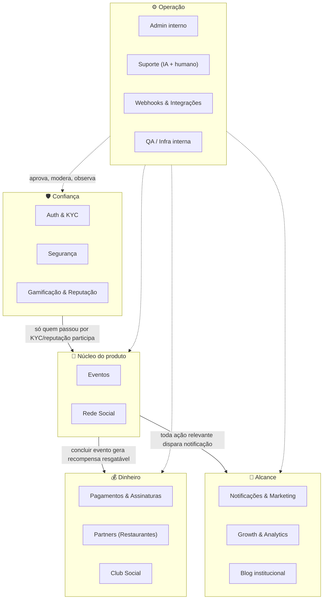

# Mesapra2

**Social dining com curadoria gastronômica.** Conecta pessoas através de eventos em restaurantes parceiros — matching social + agenda de encontros em grupo + benefícios com curadoria de restaurantes, num produto só.

> 🔒 Este repositório é uma vitrine pública da arquitetura do produto. **Não contém código-fonte** — o app em produção vive num repositório privado. O objetivo aqui é mostrar como o sistema é organizado e o que já está implementado, não como ele é codado.

   

---

## Sumário

- [Jornada](#jornada)
- [O que é](#o-que-é)
- [Stack principal](#stack-principal)
- [Arquitetura em 5 grupos](#arquitetura-em-5-grupos)
- [Domínios funcionais](#domínios-funcionais)
- [Fluxos em destaque](#fluxos-em-destaque)
- [Ecossistema de integrações](#ecossistema-de-integrações)
- [Confiabilidade e Compliance](#confiabilidade-e-compliance)
- [Documentos institucionais](#documentos-institucionais)
- [Status](#status)

## Jornada

Da concepção ao app publicado nas duas lojas — linha do tempo real, sem os números financeiros (esses ficam só para investidores).

| Quando | Marco |
|---|---|
| Jun 2025 | 💡 Concepção — a tese nasce: matching social + agenda de eventos em grupo + curadoria de restaurantes |
| Ago 2025 | 🧱 Início do desenvolvimento — site institucional mesapra2.com no ar |
| Out 2025 | 🚀 Product Hunt + primeiro commit (26/10/2025) — início do histórico público do código |
| Jan 2026 | 🏛️ CNPJ aberto — MESAS DO BRASIL (I.S.), Inova Simples (Lei Complementar 167/2019) |
| Jan 2026 | ™️ Marca depositada no INPI |
| Mar 2026 | 🏆 "Versão Dourada" (v1.0.61) — primeiras features principais consolidadas |
| Abr 2026 | 📱 Soft launch Android na Play Store (Google Play Billing integrado) |
| Jul 2026 | 💳 Monetização via RevenueCat + Google Play (Club) |
| Ago 2026 | ⚙️ Pipeline de release automatizado — build → e2e → AAB → Play → watcher |
| Set 2026 | 🍎 App publicado na App Store — Android e iOS no ar |
| Set 2026 | 🌎 App em espanhol — neutro para LatAm + variante rioplatense (AR/UY) |
| Set 2026 | ⚡ Entrada do app 5× mais rápida (6,85s → 1,29s em rede lenta) — acessibilidade 100/100 |
| Set 2026 | 🛡️ Segurança como infraestrutura — captcha em todos os pontos de entrada, isolamento de dados pessoais, rate limiting compartilhado |
| Set 2026 | 💬 Verificação por WhatsApp oficial (Meta, empresa verificada pelo CNPJ) |
| Set 2026 | 📧 E-mail corporativo com domínio autenticado (Google Workspace + SPF/DKIM/DMARC) |
| Set 2026 | 🔁 Android e iOS lançados na mesma versão (1.0.246) |
| Set 2026 | 🔒 Segurança em padrão internacional — CAA, MTA-STS, CSP sem exceções, LGPD + GDPR |
| Set 2026 | ✉️ E-mail transacional em produção no Amazon SES (saiu do sandbox) |
| Out 2026 | 🔍 Postura de segurança auditada — controle de acesso por linha confirmado em todo o banco, inventário de componentes (SBOM) gerado a cada build |

## O que é

O Mesapra2 cruza três coisas que hoje existem separadas: matching social (tipo Tinder), agenda de encontros em grupo (tipo Partiful) e um clube de benefícios com restaurantes parceiros. O usuário cria ou entra num evento, é aprovado pelo anfitrião, conversa no chat do evento, participa — e sai dali com reputação e recompensas resgatáveis nos parceiros.

- 📱 Apps nativos (Android + iOS) via Capacitor, mais webapp
- 🌎 App Android distribuído oficialmente em 6 países: Brasil, Argentina, Chile, Colômbia, Uruguai e Venezuela — iOS publicado na App Store
- 🛡️ Compliance como diferencial: KYC obrigatório, modo de segurança em encontros, trust score
- 💳 Dois modelos de assinatura (social Premium / Club de benefícios) + monetização com parceiros

## Stack principal

     

**Backend:** Node.js (funções serverless) · PostgreSQL via Supabase (Auth + RLS)
**Infra:** Vercel (deploy + edge functions) · CI/CD bloqueante (build, contratos, testes, cobertura)

## Arquitetura em 5 grupos

O sistema é organizado em 16 domínios funcionais, agrupados em 5 clusters. O **Núcleo** (Eventos + Rede Social) é o motivo do app existir — os outros quatro grupos existem para sustentar, monetizar, divulgar e operar o núcleo.

## Domínios funcionais

| Cluster | Domínio | O que faz |
|---|---|---|
| 🎯 Núcleo | **Eventos** | Criar, candidatar-se, aprovar, chat do evento, conclusão e avaliação |
| 🎯 Núcleo | **Rede Social** | Conexão 1:1 fora de evento, com chat direto e prazo de validade |
| 🛡️ Confiança | **Auth & KYC** | Login social, verificação de telefone e de identidade (KYC) |
| 🛡️ Confiança | **Segurança** | Blacklist, modo de segurança com compartilhamento de local, rate limiting |
| 🛡️ Confiança | **Gamificação & Reputação** | XP, nível, conquistas, trust score com penalidade por no-show |
| 💰 Dinheiro | **Pagamentos & Assinaturas** | Checkout, webhooks de pagamento, planos e cupons |
| 💰 Dinheiro | **Partners** | Cadastro de restaurantes, cardápio, sistema de recompensas |
| 💰 Dinheiro | **Club Social** | Benefícios corporativos via empresa parceira |
| 📣 Alcance | **Notificações & Marketing** | Push, e-mail transacional, campanhas, banners |
| 📣 Alcance | **Growth & Analytics** | Atribuição de origem, testes A/B |
| 📣 Alcance | **Blog institucional** | Conteúdo para SEO e social proof |
| ⚙️ Operação | **Admin interno** | Kanban, aprovações, painel de risco |
| ⚙️ Operação | **Suporte** | Canal de atendimento com IA de primeira linha + escalonamento humano |
| ⚙️ Operação | **Webhooks & Integrações** | Cola com provedores externos de pagamento |
| ⚙️ Operação | **QA / Infra interna** | Ferramentas de teste e verificação |

## Fluxos em destaque

### 🍽️ Partner (restaurantes)
Parceiro se cadastra → admin aprova → monta cardápio → cria recompensa → usuário resgata no balcão.
- Cadastro, solicitação e aprovação de parceiro
- Cardápio por categorias/itens, com importação em lote
- Restaurantes favoritos do usuário
- Criar/desativar vantagem (recompensa) e validar o resgate no balcão

### 🤝 Social (Topando + Reservas)
Publicar intenção → demonstrar interesse → aceitar → chat direto com validade — ou ir direto pelo fluxo de reserva (/reservar), escolhendo o restaurante primeiro.
- Chat direto com prazo de expiração, avaliação e bloqueio
- Roleta de prêmios do Topando, resgatável no parceiro
- Reserva de mesa reservation-first: busca por restaurante/bairro/cidade
- Indicação de amigos (referral) com código próprio

### 🏢 Club Social (institucional / corporativo)
Empresa parceira cadastrada → funcionário entra com código corporativo → usa benefícios → acompanha economia acumulada.
- Programa de benefícios para empresas (não é rede social — só vantagens em restaurantes)
- Trial do Club e troca para o plano pago
- Códigos de resgate gerados em lote pelo admin
- Dashboard de uso por empresa

## Ecossistema de integrações

Mapeado direto do código (dependências reais do projeto + variáveis de ambiente), não é uma lista de intenção.

**💳 Pagamentos & Assinaturas**
   

**🔐 Identidade & Segurança**
        [-EF4444?style=for-the-badge)]()

**💬 Comunicação**
   [-22C55E?style=for-the-badge&logo=twilio&logoColor=white)]() 

**🗺️ Mapas & Localização**
  

**🤖 Inteligência Artificial**
 

**🗄️ Dados & Infraestrutura**
     

**🏢 Produtividade & Operação**

**📊 Analytics**

Login do Facebook e WhatsApp Business API rodam sob um app registrado na Meta (Meta Business Suite) — Login já publicado em produção, WhatsApp com webhook e caixa de mensagens ativos. AWS (Rekognition, Textract, Amplify, SES) é hoje o caminho principal para identidade e e-mail transacional; Didit e Twilio seguem ativos como fallback.

## Confiabilidade e Compliance

Alinhado na prática com 7 padrões de mercado de segurança e qualidade de software (selos públicos em mesapra2.com — "aligned in practice", não certificação formal, que depende de auditoria externa):

      

| Padrão | Escopo | Status |
|---|---|---|
| ISO 25010:2023 | Qualidade de software | Aligned in practice |
| NIST SSDF 1.1 | Desenvolvimento seguro de software | Aligned in practice |
| OWASP ASVS 4.0.3 | Segurança de aplicação | Aligned in practice |
| CVSS v3.1 | Classificação de risco de vulnerabilidade | Implemented in production |
| SLSA / SBOM | Segurança da cadeia de suprimento de software | Implemented |
| LGPD | Dados pessoais e privacidade | Aligned |
| ISO 27001 | Prontidão de segurança da informação | Aligned |

## Documentos institucionais

    

Empresa formalizada, com marca **depositada** no INPI (consulta pública disponível na base do INPI — registro concedido é etapa posterior ao depósito).

## Status

Em produção — Android distribuído oficialmente em 6 países (Brasil, Argentina, Chile, Colômbia, Uruguai, Venezuela) via Play Store; iOS publicado na App Store. Catálogo com milhares de restaurantes mapeados em 7 países (a maior parte aguardando o dono reivindicar o perfil) — os números de parceiros com atividade real sobem junto com os ciclos de expansão comercial.

## Sobre este repositório

Mantido como referência pública de arquitetura. Issues e PRs não são aceitos aqui — para contato, veja [mesapra2.com](https://mesapra2.com).
