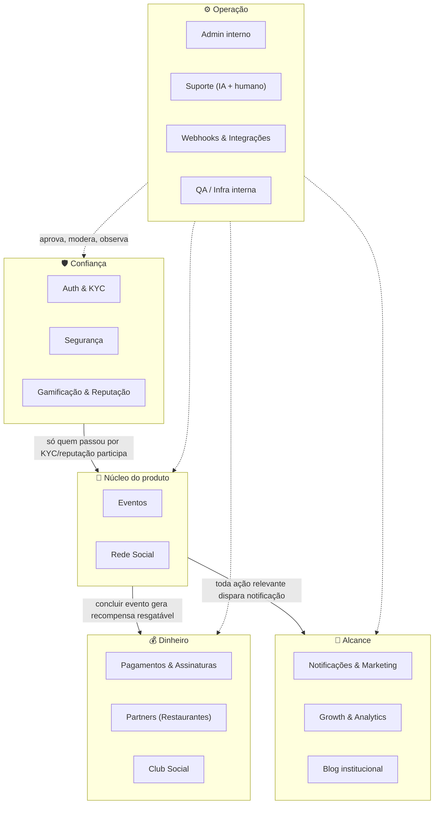

# Mesapra2

**Social dining com curadoria gastronômica.** Conecta pessoas através de eventos em restaurantes parceiros — matching social + agenda de encontros em grupo + benefícios com curadoria de restaurantes, num produto só.

> 🔒 Este repositório é uma vitrine pública da arquitetura do produto. **Não contém código-fonte** — o app em produção vive num repositório privado. O objetivo aqui é mostrar como o sistema é organizado, não como ele é implementado.

---

## O que é

O Mesapra2 cruza três coisas que hoje existem separadas: matching social (tipo Tinder), agenda de encontros em grupo (tipo Partiful) e um clube de benefícios com restaurantes parceiros. O usuário cria ou entra num evento, é aprovado pelo anfitrião, conversa no chat do evento, participa — e sai dali com reputação e recompensas resgatáveis nos parceiros.

- 📱 Apps nativos (Android + iOS) via Capacitor, mais webapp
- 🌎 App Android distribuído oficialmente em 6 países: Brasil, Argentina, Chile, Colômbia, Uruguai e Venezuela — iOS publicado na App Store
- 🛡️ Compliance como diferencial: KYC obrigatório, modo de segurança em encontros, trust score
- 💳 Dois modelos de assinatura (social Premium / Club de benefícios) + monetização com parceiros

## Arquitetura em 5 grupos

O sistema é organizado em 16 domínios funcionais, agrupados em 5 clusters. O **Núcleo** (Eventos + Rede Social) é o motivo do app existir — os outros quatro grupos existem para sustentar, monetizar, divulgar e operar o núcleo.

## Domínios funcionais

| Cluster | Domínio | O que faz |
|---|---|---|
| 🎯 Núcleo | **Eventos** | Criar, candidatar-se, aprovar, chat do evento, conclusão e avaliação |
| 🎯 Núcleo | **Rede Social** | Conexão 1:1 fora de evento, com chat direto e prazo de validade |
| 🛡️ Confiança | **Auth & KYC** | Login social, verificação de telefone e de identidade (KYC) |
| 🛡️ Confiança | **Segurança** | Blacklist, modo de segurança com compartilhamento de local, rate limiting |
| 🛡️ Confiança | **Gamificação & Reputação** | XP, nível, conquistas, trust score com penalidade por no-show |
| 💰 Dinheiro | **Pagamentos & Assinaturas** | Checkout, webhooks de pagamento, planos e cupons |
| 💰 Dinheiro | **Partners** | Cadastro de restaurantes, cardápio, sistema de recompensas |
| 💰 Dinheiro | **Club Social** | Benefícios corporativos via empresa parceira |
| 📣 Alcance | **Notificações & Marketing** | Push, e-mail transacional, campanhas, banners |
| 📣 Alcance | **Growth & Analytics** | Atribuição de origem, testes A/B |
| 📣 Alcance | **Blog institucional** | Conteúdo para SEO e social proof |
| ⚙️ Operação | **Admin interno** | Kanban, aprovações, painel de risco |
| ⚙️ Operação | **Suporte** | Canal de atendimento com IA de primeira linha + escalonamento humano |
| ⚙️ Operação | **Webhooks & Integrações** | Cola com provedores externos de pagamento |
| ⚙️ Operação | **QA / Infra interna** | Ferramentas de teste e verificação |

## Fluxos em destaque

### 🍽️ Partner (restaurantes)
Parceiro se cadastra → admin aprova → monta cardápio → cria recompensa → usuário resgata no balcão.
- Cadastro, solicitação e aprovação de parceiro
- Cardápio por categorias/itens, com importação em lote
- Restaurantes favoritos do usuário
- Criar/desativar vantagem (recompensa) e validar o resgate no balcão

### 🤝 Social (Topando + Reservas)
Publicar intenção → demonstrar interesse → aceitar → chat direto com validade — ou ir direto pelo fluxo de reserva (/reservar), escolhendo o restaurante primeiro.
- Chat direto com prazo de expiração, avaliação e bloqueio
- Roleta de prêmios do Topando, resgatável no parceiro
- Reserva de mesa reservation-first: busca por restaurante/bairro/cidade, 56 cidades e 6 países já no catálogo
- Indicação de amigos (referral) com código próprio

### 🏢 Club Social (institucional / corporativo)
Empresa parceira cadastrada → funcionário entra com código corporativo → usa benefícios → acompanha economia acumulada.
- Programa de benefícios para empresas (não é rede social — só vantagens em restaurantes)
- Trial do Club e troca para o plano pago
- Códigos de resgate gerados em lote pelo admin
- Dashboard de uso por empresa

## Confiabilidade & Compliance

Alinhado na prática com 7 padrões de mercado de segurança e qualidade de software (selos públicos em mesapra2.com):

| Padrão | Escopo | Status |
|---|---|---|
| ISO 25010:2023 | Qualidade de software | Aligned in practice |
| NIST SSDF 1.1 | Desenvolvimento seguro de software | Aligned in practice |
| OWASP ASVS 4.0.3 | Segurança de aplicação | Aligned in practice |
| CVSS v3.1 | Classificação de risco de vulnerabilidade | Implemented in production |
| SLSA / SBOM | Segurança da cadeia de suprimento de software | Implemented |
| LGPD | Dados pessoais e privacidade | Aligned |
| ISO 27001 | Prontidão de segurança da informação | Aligned |

Integrações de plataforma: Login nativo via Facebook SDK (app aprovado na Meta) e WhatsApp Business API (webhook e caixa de mensagens em produção), além de KYC (Didit) e verificação de identidade.

## Stack

**Cliente:** React + Vite, Capacitor (Android/iOS), TailwindCSS, i18next (pt-BR/es/en)
**Backend:** Node.js (funções serverless), PostgreSQL via Supabase (Auth + RLS)
**Infra:** Vercel (deploy + edge functions), CI/CD bloqueante (build, contratos, testes, cobertura)
**Integrações:** Mercado Pago, RevenueCat (IAP Google Play/Apple), KYC via Didit, Google Maps/Places, Login do Facebook, WhatsApp Business API

## Status

Em produção — Android distribuído oficialmente em 6 países (Brasil, Argentina, Chile, Colômbia, Uruguai, Venezuela) via Play Store; iOS publicado na App Store. Catálogo com 2865+ restaurantes parceiros em 56 cidades.

## Sobre este repositório

Mantido como referência pública de arquitetura. Issues e PRs não são aceitos aqui — para contato, veja [mesapra2.com](https://mesapra2.com).
